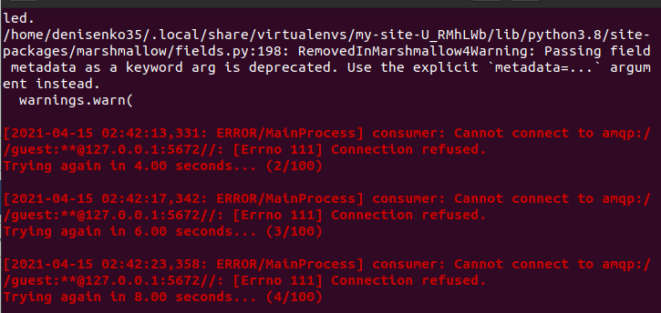

# Чому не вдалося встановити Іnvenio

## Проблема із першою спробою встановлення Invenio

У ході спроби встановлення програмного забезпечення [Invenio](https://inveniosoftware.org/) виникла наступна проблема:

Встановити причини виникнення такої ситуації не вдалося. Шукаючи варіанти вирішення проблеми, ми спробували видалити всі встановленні модулі і пакети та встановити ії повторно. Але проведені маніпуляції не принесли очікуваного результату, і ситуація не змінилася - все одно виводилася дана помилка.

## Проблема із другою спробою встановлення Invenio

По-перше, можна сказати, що інструкція для встановлення `pipenv` не зовсім вірна. Так розробники [Invenio](https://inveniosoftware.org/) пропонують встановлювати цей інструмент [такимм чином](https://pipenv.readthedocs.io), але при цьому надалі виникали конфлікти, пов'язані з тим, що після встановлення він був недоступний в оболонці. Тоді потрбно додати базу користувачів у двійковий каталог до вашого PATH. Цей варіант прописан [тут](002-prerequisites/) або за прямим посиланням - [тут](https://manpages.ubuntu.com/manpages/eoan/man1/pipenv.1.html). 
