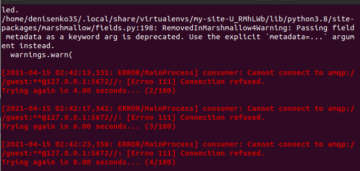
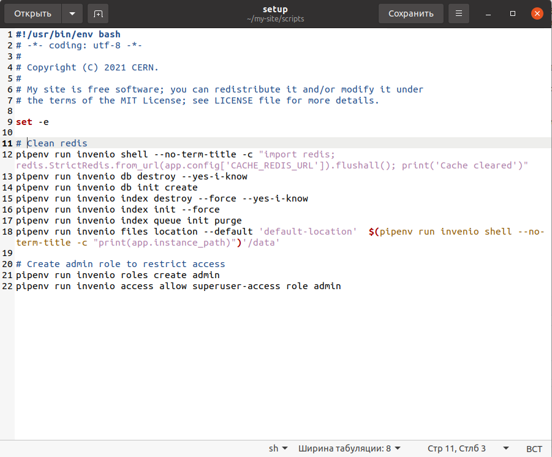
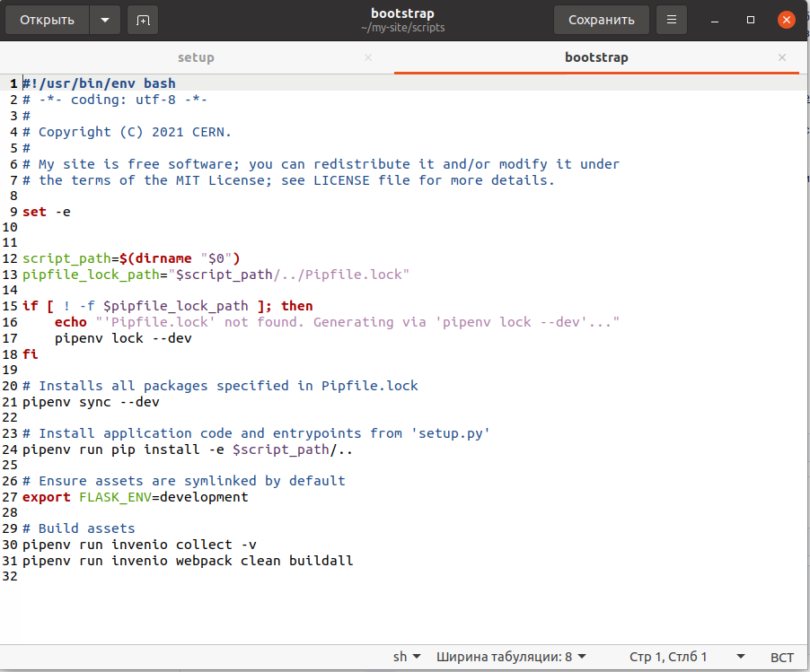
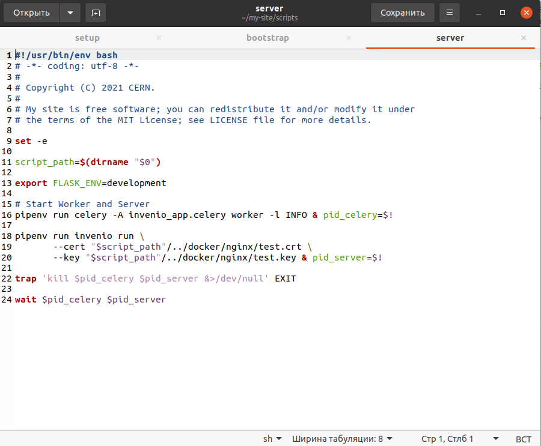
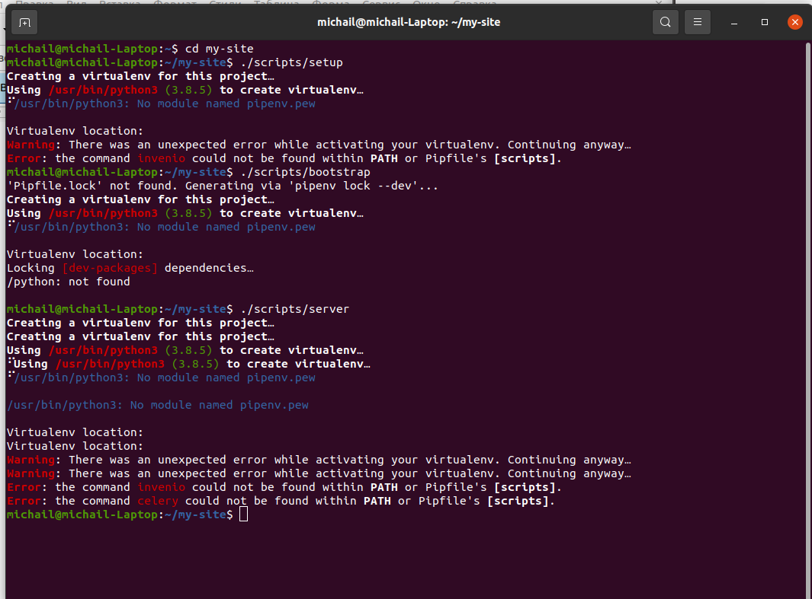
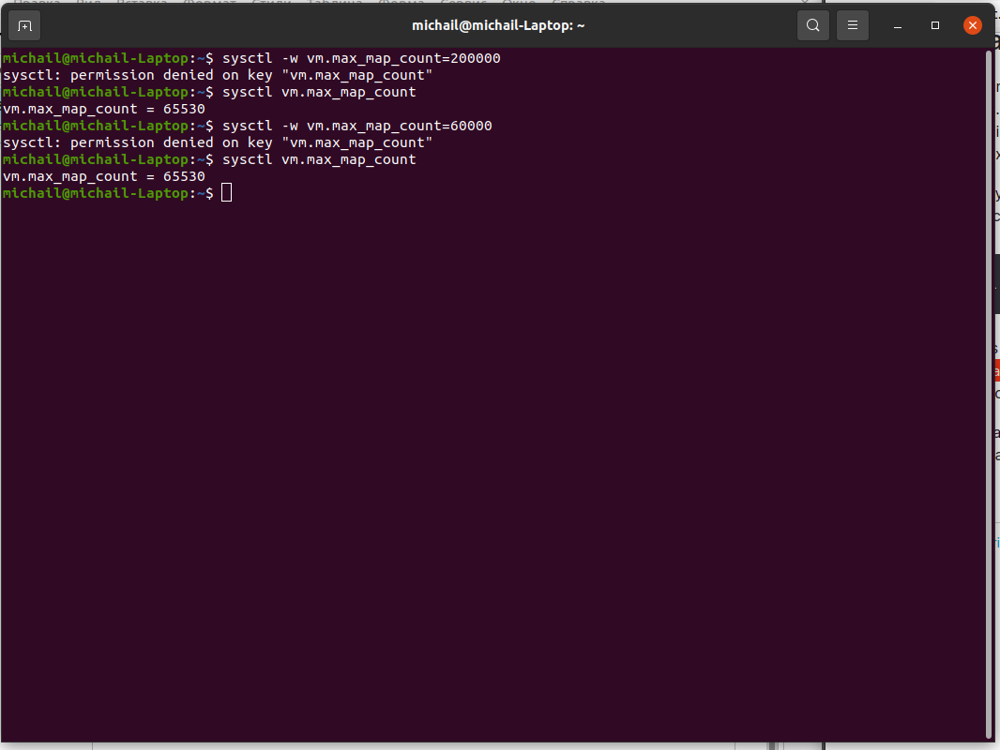
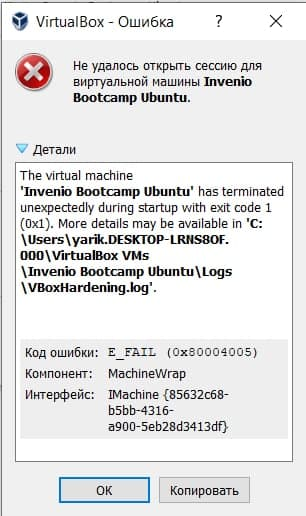
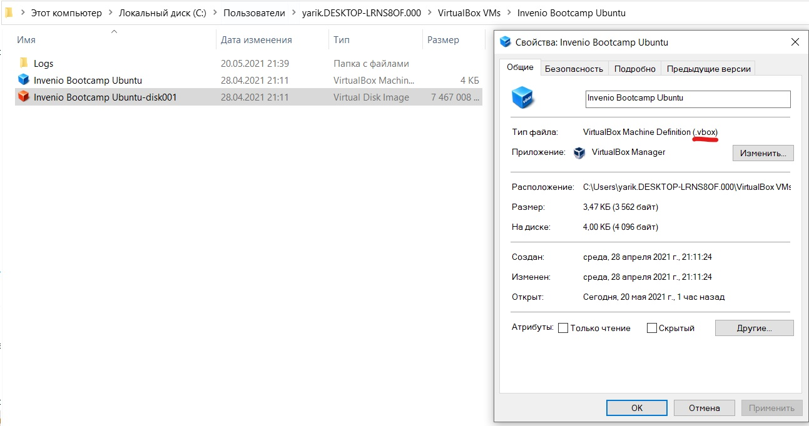
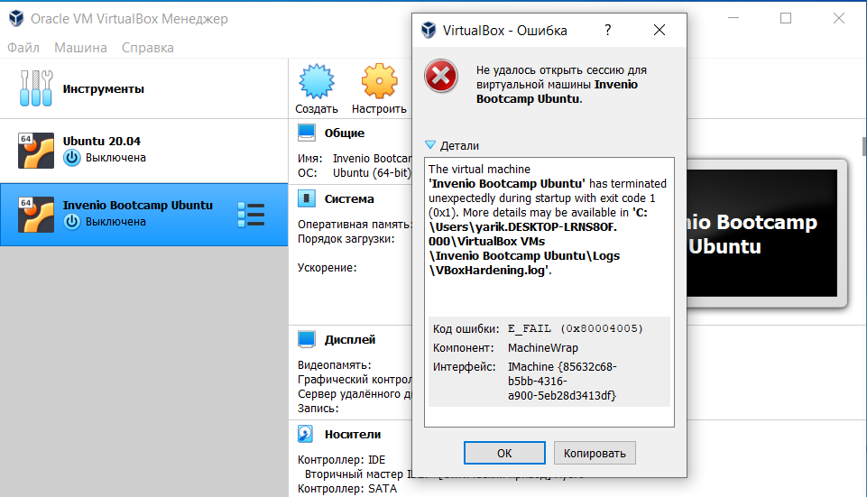
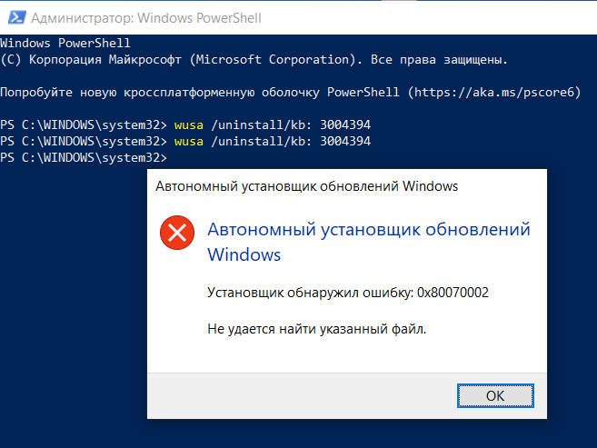

# Чому не вдалося встановити Іnvenio
## Інсталяція Іnvenio на операційну систему Лінукс, встановлену паралельно з Windows
### Проблема із першою спробою встановлення Invenio

У ході спроби встановлення програмного забезпечення [Invenio](https://inveniosoftware.org/) виникла наступна проблема:

Встановити причини виникнення такої ситуації не вдалося. Шукаючи варіанти вирішення проблеми, ми спробували видалити всі встановленні модулі і пакети та встановити ії повторно. Але проведені маніпуляції не принесли очікуваного результату, і ситуація не змінилася - все одно виводилася дана помилка.

### Проблема із другою спробою встановлення Invenio

По-перше, можна сказати, що інструкція для встановлення `pipenv` не зовсім вірна. Так розробники [Invenio](https://inveniosoftware.org/) пропонують встановлювати цей інструмент [такимм чином](https://pipenv.readthedocs.io), але при цьому надалі виникали конфлікти, пов'язані з тим, що після встановлення він був недоступний в оболонці. Тоді потрбно додати базу користувачів у двійковий каталог до вашого PATH. Цей варіант прописан [тут](../002-prerequisites/) або за прямим посиланням - [тут](https://manpages.ubuntu.com/manpages/eoan/man1/pipenv.1.html). 

По-друге, при самому створенні сайта необхідно завантажити папку my-site (вона завантажується автоматично), в якій вже існують файли для створення цього сайту.

Зміст файлів можна побачити тут:

#### setup:

#### bootstrap:

#### server:

Але при звертанні до цих файлів, як вказано в [інструкції](https://github.com/InvenioDevelopers/training/tree/master/01-getting-started), виводилось повідомлення про невідому команду ivenio:

Також, при створенні virualenv виводиться ще одна помилка про те, що неіснує модуля pipenv.pew. Це може також бути пов'язано з тим, що неможливо змінити `virtual memory`. Я встановив [Ubuntu](https://ubuntu.ru/) паралельно з [Windows](https://www.microsoft.com/uk-ua/software-download/), можливо, через це система не дозволяє мені змінити обсяж віртуальної пам'яті, щоб не було конфлікту з [Windows](https://www.microsoft.com/uk-ua/software-download/):

Хоча система визначає 480 Гб пам'яті, але виводить все одно 65530 мб.

## Інсталяція Іnvenio на VirtualBox у Windows 10

Після успішного встановлення VirtualBox, а також Invenio Bootcamp Ubuntu на нього (інструкцію можна знайти [тут](https://github.com/InvenioDevelopers/InvenioProject/tree/main/001-installing-ubuntu#%D1%83%D1%81%D1%82%D0%B0%D0%BD%D0%BE%D0%B2%D0%BA%D0%B0-ubuntu-2004-%D0%BD%D0%B0-virtualbox-%D1%83-windows-10)) виникла наступна проблема:

Як правило, VirtualBox вилітає з помилкою E_FAIL 0x80004005 через те, що програмі з якоїсь причини не вдалося зберегти стан вашої віртуальної машини в файл з розширенням .vbox. Причин, чому це сталося існує дуже багато, наприклад, він міг бути пошкоджений або використаний під час збереження стану для якоїсь іншої мети. Загалом, VirtualBox спробував завантажити стан ВМ з vbox-файлу, але нічого не вийшло і він видав помилку. Однак, варто зауважити, що помилка віртуальної машини E_FAIL 0x80004005 могла виникнути також через низку інших причин: конфліктує із VirtualBox оновлення для операційної системи, відключена функція віртуалізації в BIOS або нестабільна версія самої програми VirtualBox. 

### Метод №1 Перейменування vbox-файлу:

- пройдіть в директорію **C: \ Users \ <ПОЛЬЗОВАТЕЛЬ> \ VirtualBox VMs \**
- знайдіть в ній файли з ім'ям вашої віртуальної машини і розширенням  .vbox і  .vbox-prev (або -tmp ), наприклад, нехай це будуть ВМ.vbox і ВМ.vbox-prev

- Скопіюйте файл ВМ.vbox у окрему папку, а потім видаліть його з поточної
- Перейменуйте ВМ.vbox-prev в ВМ.vbox;
- далі далі перейдіть в директорію  **C: \ Users \ <ПОЛЬЗОВАТЕЛЬ> \. VirtualBox \.** і виконайте все описане вище ще раз, тобто видалення і перейменування файлів. 

Як тільки завершите перейменування та видалення файлів, спробуйте знову запустити потрібну вам віртуальну машину у  VirtualBox. Якщо подібні маніпуляції не допомогли, то спробуйте позбутися цієї проблеми наступним методом.

Після виконання даних маніпуляцій нічого не змінилося, тому я перейшов до 2-го методу:

### Метод №2 Видалення поновлення KB: 3004394:

Видалити Видалити це оновлення можна як через графічний інтерфейс системи, так і через консоль. Однак, через консоль процес видалення виконується куди швидше. Тому розглянемо саме цей спосіб видалення оновлення. Виконайте наступні дії: 

- натисніть на клавіатурі **Windows + X**
- виберіть з контекстного меню пункт «Командний рядок (адміністратор)»
- впишіть в консоль команду  **wusa / uninstall / kb: 3004394 і натисніть Enter**

Після виконання вказаних дій з'являється наступна помилка:

### Метод №3 Підбір робочої версії VirtualBox

Рекомендується встановлювати останню версію VirtualBox, але якщо помилка з'явится і на ній, то необхідно знайти іншу версію, яка буде стабільно працювати на вашій системі. Виходячи з відгуків користувачів, стабільними версіями є 4.3.12, 4.3.20, 5.0.6 та 5.1.8.

Після інших невдалих спроб виправити помилку я знайшов ще кілька порад які також не допомогли:

- Встановити абсолютно всі останні оновлення Windows 10
- Якщо у вас встановлений VipNet CSP, то його необхідно видалити його і проблема зникне
- Активування візуалізації в BIOS. Даний метод не рекомендується тим, хто нічого не знає про BIOS і не вміє з ним працювати (конкретніше [тут](https://geekhow.ru/programmy/e_fail-0x80004005/))

